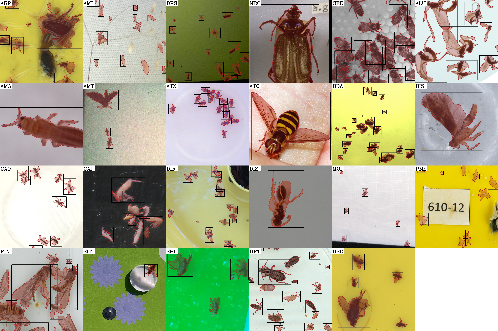

`flat-bug` is partly a high-performance pyramid tiling inference wrapper for [`YOLOv8`](https://github.com/ultralytics/ultralytics) and partly a hybrid instance segmentation dataset of terrestrial arthropods accompanied by an appropriate training schedule for `YOLOv8` segmentation models, built on top of the original [`YOLOv8` training schedule](https://docs.ultralytics.com/modes/train/#why-choose-ultralytics-yolo-for-training). 

The goal of `flat-bug` is to provide a single unified model for detection and segmentation of all terrestrial arthropods on arbitrarily large images, especially fine-tuned for the case of top-down images/scans - thus the name `"flat"-bug`.

**<center><ins>Insert Preprint/Paper Reference Here</ins></center>**

### Installation
The latest version of `flat-bug` can be installed with any of your favourite package managers such as:
#### `pip`
```py
python -m pip install flat-bug
```
#### `anaconda`
```py
conda install flat-bug -c conda-forge
```
#### `mamba`
```py
mamba install flat-bug -c conda-forge
```
#### `micromamba`
```py
micromamba install flat-bug -c conda-forge
```
#### Source/development
Or a development version can be installed from source by cloning this repository:
```sh
git clone git@github.com:darsa-group/flat-bug.git
cd flat-bug
git checkout develop
pip install -e .
```

However, as with other packages built with `PyTorch` it is best to ensure that `torch` is installed separately. See [https://pytorch.org/](https://pytorch.org/) for details. We recommend using `torch>=2.3`.

### Usage
#### CLI
We provide a number of [CLI scripts[INSERT LINK]](INSERT_LINK) with `flat-bug`. The main one of interest is `fb_predict`, which can be used to run inference on images or videos:
```sh
fb_predict -i <DIR_WITH_IMGS> -o <OUTPUT_DIR> [-w <WEIGHT_PATH>] ...
```

#### Python
`flat-bug` also has a very user-friendly Python API, which can be used with only a few lines:
```py
from flat_bug.predictor import Predictor

# Load the model
model = Predictor(model = "flat_bug_L.pt", device="cuda:0", dtype="float16")

# Run inference on an image
output = model("test_image.jpg")

# Save a visualization of the predictions
output.plot(outpath="test_result.jpg")

# # or plot with matplotlib
# from matplotlib import pyplot as plt
# plt.imshow(output.plot())
# plt.axis("off")
# plt.show()

# Fetch the localized instances and segmentation masks
# as PyTorch tensors for further analysis
crops = output.crops
masks = output.crop_masks
masked_crops = [c * m for c, m in zip(crops, masks)]

## Classify the crops
# classification = classification_model(<crops | masked_crops>)

# # or plot with matplotlib
# fig, axs = plt.subplots(2, 6, figsize = (15, 5))
# for i, ax in enumerate(axs.flatten()):
#     ax.imshow(masked_crops[i].cpu().permute(1, 2, 0))
#     ax.axis("off")
# plt.show()

# Inspect the results as a native Python dictionary
results = output.json_data

# Save the results
import os

os.makedirs("test_output")
output.save(
    output_directory="test_output", # Mandatory
    overview=True, # optional
    crops=True, # optional
    metadata=True, # optional
    mask_crops=True, # optional
    # ... # optional
)
```

### Tutorials
We provide a number of tutorials on general and advanced usage, training, deployment and hyperparameters of `flat-bug` in [examples/tutorials](examples/tutorials) or with Google Colab (see our [docs[INSERT LINK]](INSERT_LINK)).

### Archive
#### Models

#### Data

### Contributions
#### Code

#### Data
